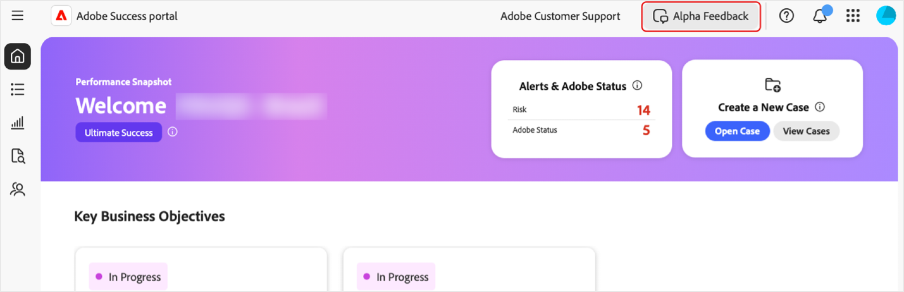

# Accedere al portale [!DNL Adobe Success]

Questa guida spiega come accedere al portale [!DNL Adobe Success] e ricevere assistenza in caso di problemi di accesso.

Riceverai una notifica dal team del portale **[!UICONTROL Success]** che conferma l’accesso. Questo messaggio includerà i dettagli di accesso.

1. Vai a [https://experience.adobe.com/](https://experience.adobe.com/).
1. Accedi con il tuo Adobe ID.
1. Seleziona l’icona del **[!UICONTROL portale Success (Alpha)]**.

   ")

1. Una volta effettuato l’accesso, vengono visualizzate cinque schede:

   

   * Home
   * **[!UICONTROL Piano d’azione]**
   * **[!UICONTROL Tracciamento del valore]**
   * **[!UICONTROL Assistenza e insight]**
   * **[!UICONTROL Piano di coinvolgimento dell’assistenza]**

## Risoluzione dei problemi e assistenza

In caso di problemi durante l’accesso al portale o alle relative funzionalità, contatta il nostro team tramite il [canale Teams Alpha](https://teams.microsoft.com/l/channel/19:h-GcuAZs9uF05rervqTdx2U27ohYINuRUIfbMte9B-U1@thread.tacv2/General?groupId=02b87789-3475-47e4-94c1-0981f63ae89f&tenantId=fa7b1b5a-7b34-4387-94ae-d2c178decee1).   

Puoi usare il pulsante **[!UICONTROL Feedback Alpha]** sul portale per inviare feedback.

>[!NOTE]
>
>Lo strumento di feedback non è un canale di supporto dedicato. Non è adatto per problemi di accesso urgenti.

