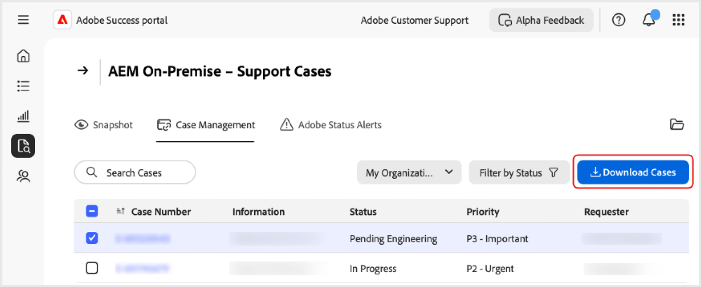

# Creare e gestire i casi nel portale [!DNL Adobe Success]

Questa guida spiega come creare, visualizzare e scaricare rapporti relativi ai casi nel portale [!DNL Adobe Success].

## Aprire un caso

Puoi aprire un caso dalla scheda Home o dalla scheda **[!UICONTROL Assistenza e insight]**.

Per accedere alla pagina **[!UICONTROL Apri caso]** dalla scheda Home:

1. Passa alla scheda Home.
1. Seleziona **[!UICONTROL Apri caso]**.

   

1. Compila i campi obbligatori:
   1. **[!UICONTROL Seleziona un prodotto]**.
   1. **[!UICONTROL Titolo caso]**.
   1. **[!UICONTROL Descrizione del caso]**.
1. Seleziona **[!UICONTROL Invia caso]**.

   

Per accedere alla pagina **[!UICONTROL Apri caso]** dalla scheda **[!UICONTROL Assistenza e insight]**.

1. Passa alla scheda **[!UICONTROL Assistenza e insight]**.
1. Seleziona **[!UICONTROL Apri caso]**.

   

Segui gli stessi passaggi indicati sopra per completare e inviare il caso.

## Visualizzare un caso

Puoi visualizzare un caso dalla scheda Home o dalla scheda **[!UICONTROL Assistenza e insight]**.

Per accedere alla pagina **[!UICONTROL Visualizza casi]** dalla scheda Home:

1. Passa alla scheda Home.
1. Seleziona **[!UICONTROL Visualizza casi]**.

   

1. Seleziona la scheda prodotto che desideri visualizzare, quindi scegli **[!UICONTROL Casi aperti]** o **[!UICONTROL Casi chiusi]**.

   >[!NOTE]
   >
   >Puoi anche selezionare la scheda **[!UICONTROL Assistenza e insight]** per accedere rapidamente alle schede prodotto con collegamenti a **[!UICONTROL casi aperti]** o a **[!UICONTROL casi chiusi]**.

   

1. Fai clic su **[!UICONTROL Numero caso]** per visualizzare i dettagli del caso.

   

## Scaricare i rapporti sui casi

Per scaricare i rapporti in PDF dei casi:

1. Passa alla scheda Home.
1. Seleziona **[!UICONTROL Visualizza casi]**.

   

1. Seleziona la scheda prodotto che desideri visualizzare, quindi scegli **[!UICONTROL Casi aperti]** o **[!UICONTROL Casi chiusi]**.

   >[!NOTE]
   >
   >Puoi anche selezionare la scheda **[!UICONTROL Assistenza e insight]** per accedere rapidamente alle schede dei prodotti con collegamenti a **[!UICONTROL casi aperti]** o a **[!UICONTROL casi chiusi]**.

   

1. Nella pagina [Prodotto] - Casi di supporto, seleziona la casella di controllo accanto al caso che desideri scaricare e seleziona **[!UICONTROL Scarica casi]**.

   
