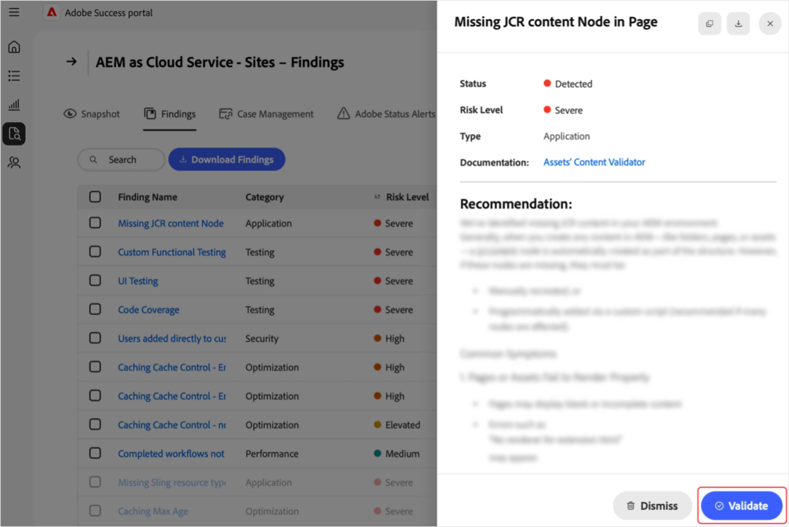

# Gestisci risultati nel portale [!DNL Adobe Success]

Questa guida spiega come accedere, interpretare e agire sui risultati nel portale [!DNL Adobe Success] per gestire in modo proattivo i rischi relativi a prestazioni, sicurezza e funzionalità dei prodotti.

Nella pagina del portale [!DNL Adobe Success] **[!UICONTROL Risultati]** sono visualizzati problemi o rischi rilevati nell&#39;istanza del prodotto Adobe. I risultati includono problemi di prestazioni, sicurezza e funzionalità, insieme al loro stato e livello di rischio. Il monitoraggio di questa pagina consente di risolvere i problemi in anticipo, prima che influiscano sugli ambienti.

**Quali sono i risultati?**

I risultati sono avvisi di Approfondimenti supporto visualizzati nel portale [!DNL Adobe Success]. Evidenziano potenziali problemi nella configurazione del prodotto Adobe, come rallentamenti delle prestazioni, rischi per la sicurezza o configurazioni non corrette. Questi avvisi si basano sui dati di telemetria raccolti da strumenti come API, [!DNL New Relic] e [!DNL Splunk].

**Come vengono creati i risultati?**

I team di Adobe studiano regolarmente i problemi e le tendenze di supporto più comuni. In base alle informazioni raccolte, vengono aggiunti nuovi controlli al sistema. Una volta al giorno, il portale [!DNL Adobe Success] analizza i dati dei prodotti per rilevare eventuali problemi, ad esempio configurazioni errate, processi bloccati o qualsiasi cosa che possa causare un&#39;interruzione del sistema. Se un controllo rileva qualcosa che non rientra nell’intervallo di sicurezza (come definito dai team di prodotto e supporto di Adobe), viene visualizzato come un risultato.

**Perché i risultati sono importanti**

Rivedere i risultati regolarmente aiuta a individuare i problemi in anticipo, prima che influiscano sul sistema o sui clienti. Questo approccio proattivo migliora la stabilità del sistema, riduce i tempi di inattività e supporta le best practice.

**Come correggere i risultati**

Ogni risultato include consigli e istruzioni chiare su come risolvere il problema, insieme a collegamenti alla documentazione pertinente, se disponibile. Condividi questi risultati con il tuo team IT, ingegneristico o partner Adobe e collabora per affrontarli. La risoluzione anticipata di questi problemi consente di evitare problemi più gravi e garantisce il corretto funzionamento del sistema.

## Accedere ai risultati

Per visualizzare informazioni su un prodotto:

1. Passa a **[!UICONTROL Supporto e approfondimenti]**.
1. Seleziona la scheda prodotto pertinente. Selezionare la scheda **[!UICONTROL Risultati]**.

   

1. Viene visualizzato un elenco di tutti i risultati per il prodotto selezionato.

   

1. Da qui è possibile:

   

   * Cerca voci specifiche.
   * Esporta l&#39;elenco dei risultati selezionando **[!UICONTROL Scarica risultati]**. Per esportare un report per un risultato, selezionare la casella di controllo accanto al risultato rilevante nella colonna **[!UICONTROL Nome risultato]**. Se non si seleziona un risultato, per impostazione predefinita il PDF contiene un elenco di tutti i risultati.
   * Visualizzare i dettagli di un risultato, inclusa una risoluzione consigliata selezionando un risultato in **[!UICONTROL Nome risultato]**. Nella pagina dei dettagli del risultato viene visualizzato il risultato selezionato con un contesto aggiuntivo e un consiglio. Per visualizzare questo rapporto, seleziona la freccia di download.

     

## Risultati azione

Segui questi passaggi per verificare se ogni risultato è ancora applicabile o può essere ignorato.

>[!NOTE]
>
>I controlli standard vengono eseguiti sulle istanze. Se i controlli non rilevano che il problema è presente nell&#39;istanza, lo stato è **[!UICONTROL Non rilevato]**.

1. Passa a **[!UICONTROL Supporto e approfondimenti]**.
1. Seleziona la scheda prodotto pertinente.
1. Apri la scheda **[!UICONTROL Risultati]**. Puoi visualizzare tutti i risultati per il prodotto selezionato.
1. Selezionare una voce in **[!UICONTROL Nome risultato]**. Nella pagina dei dettagli del risultato è possibile effettuare le seguenti operazioni:
   * Seleziona **[!UICONTROL Convalida]** per verificare se il problema è ancora presente (il pulsante **[!UICONTROL Convalida]** è progettato per confermare che il problema è stato risolto):

   

   * Se il problema persiste, viene visualizzato il seguente messaggio: *[!UICONTROL Convalida completata. Trovato ancora rilevato]*. Utilizza le informazioni e i consigli nella pagina Dettagli del risultato per indagare e risolvere.
   * Se il problema non è più presente, viene visualizzato il seguente messaggio: *[!UICONTROL Convalida completata. Non è più possibile rilevare]*. Quando il risultato non viene più rilevato, il risultato diventa grigio e lo stato diventa **[!UICONTROL Non rilevato]**. I risultati con stato **[!UICONTROL Non rilevato]** si trovano in fondo all&#39;elenco dei risultati.
   * Se il problema non è applicabile o rilevante per te, puoi ignorarlo selezionando **[!UICONTROL Ignora]**. Quando il risultato viene ignorato, diventa grigio e lo stato diventa **[!UICONTROL Ignorato]**.  I risultati con stato **[!UICONTROL Ignorato]** si trovano in fondo all&#39;elenco dei risultati.

## Comprendere i risultati

* **[!UICONTROL Nome risultato]** - Selezionare per informazioni dettagliate e passaggi di risoluzione consigliati.
* **[!UICONTROL Tipo]** - Classificato come *Funzionalità*, *Prestazioni* e *Sicurezza*.
* **[!UICONTROL Livello di rischio]** - Indicatore di gravità, con indicatori visivi.
* **[!UICONTROL Stato]** - Stato corrente del risultato (ad esempio *Rilevato*, *Non rilevato*, *Ignorato*).
* **[!UICONTROL Controlla ultima esecuzione]** - Timestamp dell&#39;ultimo controllo che ha aggiornato il risultato.

## Best practice

Nella pagina **[!UICONTROL Risultati]** sono elencati i consigli con i seguenti livelli di rischio: **[!UICONTROL Elevato]**, **[!UICONTROL Elevato]** e **[!UICONTROL Medium]**. **[!UICONTROL Elevato]** è critico, **[!UICONTROL Elevato]** è urgente e **[!UICONTROL Medium]** non critico. Per mantenere lo stato e le prestazioni del sito:

* Risolvi immediatamente i problemi di **[!UICONTROL rischio elevato]**, in quanto rappresentano minacce critiche.
* Risolvi **[!UICONTROL Problemi di rischio elevati]** per evitare l&#39;escalation.
* Monitora regolarmente i risultati dei rischi di **[!UICONTROL Medium]** e agisci come necessario.

