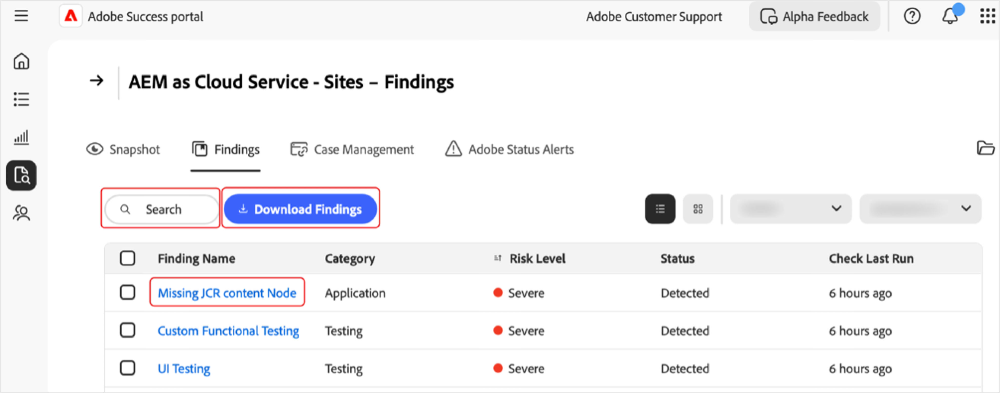

# Gestire risultati nel portale [!DNL Adobe Success]

Questa guida spiega come accedere, interpretare e agire sui risultati nel portale [!DNL Adobe Success] per aiutarti a gestire in modo proattivo i rischi relativi a prestazioni, sicurezza e funzionalità dei prodotti.

Nella pagina **[!UICONTROL Risultati]** del portale [!DNL Adobe Success] sono visualizzati problemi o rischi rilevati nell’istanza del prodotto Adobe. I risultati includono problemi di prestazioni, sicurezza e funzionalità, insieme al loro stato e livello di rischio. Il monitoraggio di questa pagina consente di risolvere i problemi in anticipo, prima che influiscano sugli ambienti.

**Che cosa sono i risultati?**

I risultati sono avvisi relativi a insight di assistenza visualizzati nel portale [!DNL Adobe Success]. Evidenziano potenziali problemi nella configurazione del prodotto Adobe, come rallentamenti delle prestazioni, rischi per la sicurezza o configurazioni non corrette. Questi avvisi si basano sui dati di telemetria raccolti da strumenti come API, [!DNL New Relic] e [!DNL Splunk].

**Come vengono creati i risultati?**

I team di Adobe studiano regolarmente i problemi e le tendenze di assistenza più comuni. In base agli insight raccolti, vengono aggiunti nuovi controlli al sistema. Una volta al giorno, il portale [!DNL Adobe Success] analizza i dati dei prodotti per rilevare eventuali problemi, ad esempio configurazioni errate, processi bloccati o qualsiasi cosa che possa causare un’interruzione del sistema. Se un controllo rileva qualcosa che non rientra nell’intervallo di sicurezza (come definito dai team di prodotto e assistenza di Adobe), viene visualizzato come un risultato.

**Perché i risultati sono importanti**

Rivedere i risultati regolarmente aiuta a individuare i problemi in anticipo, prima che influiscano sul sistema o sulla clientela. Questo approccio proattivo migliora la stabilità del sistema, riduce i tempi di inattività e supporta le best practice.

**Come correggere i risultati**

Ogni risultato include consigli e istruzioni chiare su come risolvere il problema, insieme a collegamenti alla documentazione pertinente, se disponibile. Condividi questi risultati con il team IT, ingegneristico o partner Adobe e collabora con loro per affrontarli. La risoluzione anticipata di questi problemi consente di evitare problemi più gravi e mantiene il corretto funzionamento del sistema.

## Accedere ai risultati

Per visualizzare insight su un prodotto:

1. Passa a **[!UICONTROL Assistenza e insight]**.
1. Seleziona la scheda prodotto pertinente. Seleziona la scheda **[!UICONTROL Risultati]**.

   

1. Viene visualizzato un elenco di tutti i risultati per il prodotto selezionato.

   

1. Da qui, puoi:

   

   * Cerca voci specifiche.
   * Esporta l’elenco dei risultati selezionando **[!UICONTROL Scarica risultati]**. Per esportare un rapporto di un risultato, seleziona la casella di controllo accanto al risultato rilevante nella colonna **[!UICONTROL Nome risultato]**. Se non selezioni un risultato, per impostazione predefinita il PDF contiene un elenco di tutti i risultati.
   * Visualizza i dettagli di un risultato, inclusa una risoluzione consigliata, selezionando un risultato in **[!UICONTROL Nome risultato]**. Nella pagina dei dettagli del risultato viene visualizzato il risultato selezionato con contesto aggiuntivo e un consiglio. Per visualizzare questo rapporto, seleziona la freccia di download.

     

## Intervenire in base ai risultati

Segui questi passaggi per verificare se ciascun risultato è ancora applicabile o può essere ignorato.

>[!NOTE]:
>
>Sulle istanze vengono eseguiti controlli standard. Se i controlli non rilevano la presenza del problema nella tua istanza, lo stato risulterà **[!UICONTROL Non rilevato]**.

1. Passa a **[!UICONTROL Assistenza e insight]**.
1. Seleziona la scheda prodotto pertinente.
1. Apri la scheda **[!UICONTROL Risultati]**. Puoi visualizzare tutti i risultati per il prodotto selezionato.
1. Seleziona una voce in **[!UICONTROL Nome risultato]**. Nella pagina dei dettagli del risultato:
   * Seleziona **[!UICONTROL Convalida]** per controllare se il problema è ancora presente (il pulsante **[!UICONTROL Convalida]** è progettato per confermare che il problema è stato risolto):

   

   * Se il problema persiste, viene visualizzato il seguente messaggio: *[!UICONTROL Convalida completata. Risultato ancora rilevato]*. Utilizza le informazioni e i consigli nella pagina dei dettagli del risultato per indagare e risolvere.
   * Se il problema non è più presente, viene visualizzato il seguente messaggio: *[!UICONTROL Convalida completata. Risultato non più rilevato]*. Quando non viene più rilevato, il risultato viene visualizzato in grigio e lo stato diventa **[!UICONTROL Non rilevato]**. I risultati con stato **[!UICONTROL Non rilevato]** si trovano in fondo all’elenco dei risultati.
   * Se il problema non è applicabile o rilevante per te, puoi ignorarlo selezionando **[!UICONTROL Ignora]**. Quando viene ignorato, il risultato viene visualizzato in grigio e lo stato diventa **[!UICONTROL Ignorato]**.  I risultati con stato **[!UICONTROL Ignorato]** si trovano in fondo all’elenco dei risultati.

## Informazioni sui risultati

* **[!UICONTROL Nome risultato]**: seleziona per informazioni dettagliate e passaggi di risoluzione consigliati.
* **[!UICONTROL Tipo]**: categorizzato come *Funzionalità*, *Prestazioni* e *Sicurezza*.
* **[!UICONTROL Livello di rischio]**: indicatore di gravità, con indicatori visivi.
* **[!UICONTROL Stato]**: stato corrente del risultato (ad esempio *Rilevato*, *Non rilevato*, *Ignorato*).
* **[!UICONTROL Ultima esecuzione del controllo]**: marca temporale dell’ultimo controllo che ha aggiornato il risultato.

## Best practice

Nella pagina **[!UICONTROL Risultati]** sono elencati i consigli con i seguenti livelli di rischio: **[!UICONTROL Alto]**, **[!UICONTROL Elevato]** e **[!UICONTROL Medio]**. **[!UICONTROL Alto]** è critico, **[!UICONTROL Elevato]** è urgente e **[!UICONTROL Medio]** è non critico. Per mantenere l’integrità e le prestazioni del sito:

* Risolvi immediatamente i problemi ad **[!UICONTROL alto rischio]**, in quanto rappresentano minacce critiche.
* Risolvi i problemi a rischio **[!UICONTROL elevato]** per evitare un’aggravamento.
* Monitora regolarmente i risultati a rischio **[!UICONTROL medio]** e agisci come necessario.
