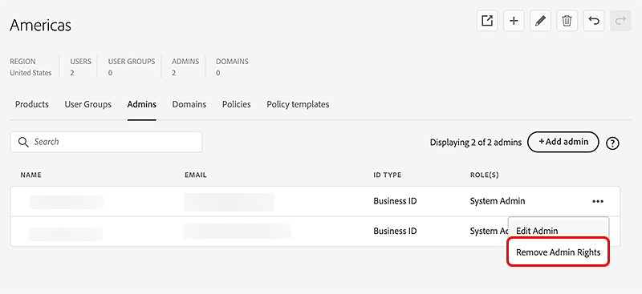

# Gestire gli amministratori

*Si applica all&#39;organizzazione.*

Esplora le funzionalità dell’amministratore globale e scopri come delegare e distribuire agli amministratori, per ogni singola organizzazione, l’amministrazione di utenti, licenze di prodotto e gruppi.

In Global Admin Console puoi selezionare un&#39;organizzazione e passare alla scheda **[!UICONTROL Amministratori]** per aggiungere, modificare o rimuovere i diritti di amministratore. Per ulteriori informazioni, fare riferimento a [Adopt global administration](https://helpx.adobe.com/it/enterprise/global-admin-console/adopt-global-administration.html). Vai a [Global Admin Console](https://global-admin-console.adobe.com/) per accedere.

Global Admin Console introduce un ruolo denominato amministratore globale. Questo ruolo è distinto da quello di amministratore di sistema e consente di effettuare le seguenti operazioni:

- Visualizza lo scenario globale dell’investimento totale in Adobe in tutte le istanze di Admin Console aggiunte alla gerarchia di Global Admin Console.
- Monitora le assegnazioni di licenze e risorse Adobe e l’utilizzo tra più istanze di Admin Console.
- Crea istanze di Admin Console o organizzazioni.
- Alloca le licenze di prodotto da un Admin Console principale o principale alle console di amministrazione figlio situate al di sotto della gerarchia.
- Mantenere le operazioni quotidiane mentre gli amministratori di sistema continuano a gestire le proprie Admin Console. Ad esempio, un amministratore globale può allocare un prodotto a un’Admin Console secondaria, ma non può assegnarlo agli utenti. L’amministratore di sistema riceverà le postazioni all’interno del proprio Admin Console e assegnerà i prodotti ai propri utenti.
- Facoltativamente, applica i criteri organizzativi a qualsiasi Admin Console nella gerarchia.

## Compiti amministrativi fondamentali

Global Admin Console è progettato per funzionare in più organizzazioni e Admin Console. La tabella seguente illustra le diverse funzionalità e dove possono essere completate: Admin Console o Global Admin Console.

<table>
  <tr>
    <th colspan="2">Attività</th>
    <th>Global Admin Console</th>
    <th>Admin Console</th>
  </tr>

<tr>
    <td colspan="2">Creare, ricordare ed eliminare organizzazioni figlio</td>
    <td align="center">Sì</td>
    <td align="center">No</td>
  </tr>

<tr>
    <td colspan="2">Utilizzo di più organizzazioni</td>
    <td align="center">Sì</td>
    <td align="center">No</td>
  </tr>

<tr>
    <td rowspan="2" valign="middle">Gestire gli amministratori</td>
    <td>Per una o più organizzazioni</td>
    <td align="center">Sì</td>
    <td align="center">No</td>
  </tr>

<tr>
    <td>Per un’organizzazione</td>
    <td align="center">Sì</td>
    <td align="center">Sì</td>
  </tr>

<tr>
    <td colspan="2">Gestire profili di prodotto e gruppi di utenti</td>
    <td align="center">Sì</td>
    <td align="center">Sì</td>
  </tr>

<tr>
    <td colspan="2">Definire e gestire le policy</td>
    <td align="center">Sì</td>
    <td align="center">No</td>
  </tr>

<tr>
    <td colspan="2">Allocazione dei prodotti tra le organizzazioni</td>
    <td align="center">Sì</td>
    <td align="center">No</td>
  </tr>

<tr>
    <td colspan="2">Allocare prodotti agli utenti</td>
    <td align="center">No</td>
    <td align="center">Sì</td>
  </tr>

<tr>
    <td colspan="2">Gestisci utenti</td>
    <td align="center">No</td>
    <td align="center">Sì</td>
  </tr>

<tr>
    <td colspan="2">Gestire i pacchetti</td>
    <td align="center">No</td>
    <td align="center">Sì</td>
  </tr>

<tr>
    <td colspan="2">Configurare domini e directory</td>
    <td align="center">No</td>
    <td align="center">Sì</td>
  </tr>

<tr>
    <td colspan="2">Gestione dello storage aziendale e della crittografia</td>
    <td align="center">No</td>
    <td align="center">Sì</td>
  </tr>
</table>

## Gestire gli amministratori

Puoi creare una gerarchia amministrativa flessibile che consenta una gestione dettagliata dell’accesso e dell’utilizzo dei prodotti Adobe. Analogamente a Adobe Admin Console, Global Admin Console consente di aggiungere amministratori di sistema, amministratori di prodotto, amministratori dei profili di prodotto, amministratori di gruppi di utenti, amministratori di distribuzione, amministratori di supporto e amministratori di storage. Questi amministratori possono eseguire le rispettive attività amministrative nelle organizzazioni di cui sono amministratori. Oltre a questi ruoli, per l’amministrazione globale sono disponibili due nuovi ruoli: amministratore globale e visualizzatore globale.

L’amministratore globale ha un ruolo transitorio. Se un utente diventa amministratore globale di un’organizzazione, diventa automaticamente amministratore globale di tutti i figli di tale organizzazione, direttamente o indirettamente. Inoltre, se nella gerarchia dell’organizzazione viene creata una nuova organizzazione, tutti gli amministratori globali di eventuali padri dell’organizzazione diventeranno immediatamente amministratori globali dell’organizzazione appena creata.

Di seguito sono riportate le funzionalità del ruolo Amministratore globale:

- Creare ed eliminare organizzazioni figlio
- Impostare e modificare i criteri
- Impostare e modificare i ruoli amministrativi
- Aggiungere e rimuovere prodotti nelle organizzazioni figlio
- Impostare o modificare le allocazioni di risorse per le organizzazioni figlio
- Gestire profili di prodotto e gruppi di utenti

Di seguito sono riportate le funzionalità del ruolo Visualizzatore globale:

- Visualizza l’elenco di gruppi di utenti, prodotti, profili di prodotto, amministratori, set di criteri e risorse nell’organizzazione e nelle organizzazioni figlie.

## Amministrazione distribuita

Gestendo gli amministratori, un amministratore globale può delegare e distribuire agli amministratori, per ogni singola organizzazione, l’amministrazione di utenti, licenze di prodotto e gruppi. L’amministratore aggiunto a un’organizzazione da un amministratore globale dispone della flessibilità necessaria per gestire l’organizzazione senza avere alcuna visibilità sull’amministrazione di altre organizzazioni. In questo modo, l’amministratore globale può delegare l’amministrazione delle risorse e degli utenti mantenendo i dati su tali risorse e utenti isolati.

Un amministratore globale può creare organizzazioni, distribuire risorse quali prodotti e storage a tali organizzazioni, gestire la configurazione delle identità e creare e applicare modelli di criteri aziendali. Un amministratore di sistema aggiunto a un’organizzazione da un amministratore globale può assegnare prodotti a utenti, onboarding degli utenti, creazione e gestione di profili di prodotto ed eseguire altre attività amministrative all’interno dell’organizzazione.

## Aggiungi un amministratore

1. In [Global Admin Console](https://global-admin-console.adobe.com/), seleziona un&#39;organizzazione da modificare, quindi passa alla scheda **[!UICONTROL Amministratori]**.

1. Selezionare **[!UICONTROL Aggiungi amministratore]**.

   

1. Nella finestra di dialogo **[!UICONTROL Aggiungi amministratore]**, immetti i **[!UICONTROL Dettagli utente]**: e-mail, nome, cognome, tipo di account e codice paese.

   Se tenti di aggiungere un utente esistente come amministratore, scegli lo stesso tipo di account dell’utente esistente, altrimenti l’operazione di aggiunta non riuscirà.

   > [ !Note]
   > 
   > Le organizzazioni possono disporre di restrizioni sui tipi di account che è possibile aggiungere. Questi possono essere basati su [criteri](https://helpx.adobe.com/it/enterprise/global-admin-console/update-policies.html) o su altri parametri di configurazione per un&#39;organizzazione. Le organizzazioni non consentono di aggiungere contemporaneamente sia utenti Adobe ID che utenti BusinessID. In generale, in un’organizzazione non dovrebbero essere presenti utenti di entrambi i tipi, ma a seconda dell’ordine in cui vengono impostate le regole, alcuni utenti di un particolare Tipo di account potrebbero essere precedenti all’applicazione di policy o regole.

1. Seleziona uno o più ruoli di amministratore dalla sezione **[!UICONTROL Diritti di amministratore]**.

   Per ruoli quali amministratore prodotto, amministratore profilo prodotto e amministratore gruppo di utenti, seleziona rispettivamente prodotti, profili e gruppi specifici.

   

1. Seleziona **[!UICONTROL Salva]**.

1. Dopo aver modificato le organizzazioni, seleziona **[!UICONTROL Rivedi modifiche in sospeso]**, quindi seleziona **[!UICONTROL Invia modifiche]** per [eseguire](https://helpx.adobe.com/it/enterprise/global-admin-console/execute-jobs.html) le modifiche.

Quando viene aggiunto un ruolo amministratore, l’utente riceve una notifica e-mail con la quale viene informato della modifica del proprio ruolo.

Dopo che l’amministratore è stato aggiunto, riceve un messaggio e-mail che lo invita ad accettare il ruolo e gli fornisce un collegamento all’Admin Console. Se vengono aggiunti come amministratori globali e come altri ruoli, riceveranno due inviti, uno a Global Admin Console e uno a Admin Console.

## Modificare un amministratore

1. Seleziona un&#39;organizzazione da modificare e passa alla scheda **[!UICONTROL Amministratori]**.

1. Seleziona l&#39;icona **[!UICONTROL Altre opzioni]** (⋮) per l&#39;amministratore pertinente, quindi seleziona **[!UICONTROL Modifica amministratore]**.

   

1. Aggiorna i dettagli dell&#39;amministratore, quindi seleziona **[!UICONTROL Salva]**.

1. Seleziona **[!UICONTROL Rivedi modifiche in sospeso]** dopo aver completato la modifica delle organizzazioni.

Nell&#39;elenco delle modifiche in sospeso viene visualizzato un comando separato per ogni ruolo amministratore aggiunto o rimosso. Dopo la revisione, seleziona **[!UICONTROL Invia modifiche]** per [eseguirle](https://helpx.adobe.com/it/enterprise/global-admin-console/execute-jobs.html).

## Rimuovi diritti amministratore

1. Seleziona un&#39;organizzazione da modificare e passa alla scheda **[!UICONTROL Amministratori]**.

1. Seleziona l&#39;icona **[!UICONTROL Altre opzioni]** (⋮) per l&#39;amministratore pertinente, quindi seleziona **[!UICONTROL Rimuovi diritti amministratore]**.

   

1. Selezionare **[!UICONTROL OK]** nella finestra di dialogo di conferma.

1. Seleziona **[!UICONTROL Rivedi modifiche in sospeso]** dopo aver completato la modifica delle organizzazioni. Dopo la revisione, seleziona **[!UICONTROL Invia modifiche]** per [eseguirle](https://helpx.adobe.com/it/enterprise/global-admin-console/execute-jobs.html).

Dopo aver eliminato un amministratore, l’utente riceve una notifica e-mail che lo informa della perdita dell’accesso ad Admin Console per tale organizzazione.

