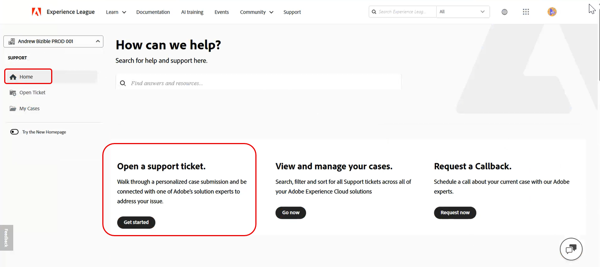
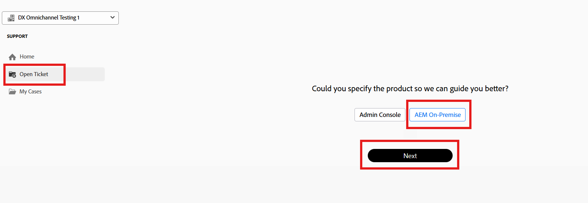
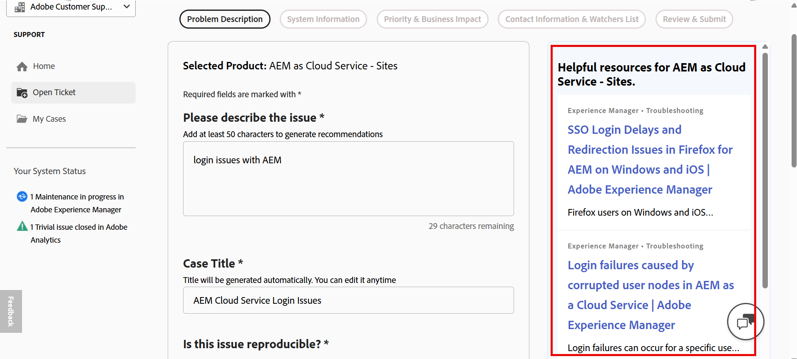
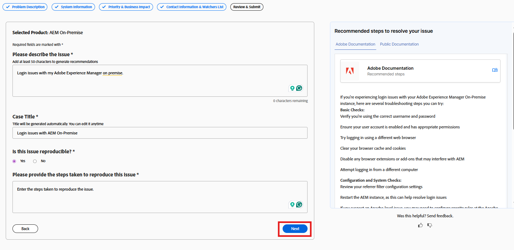
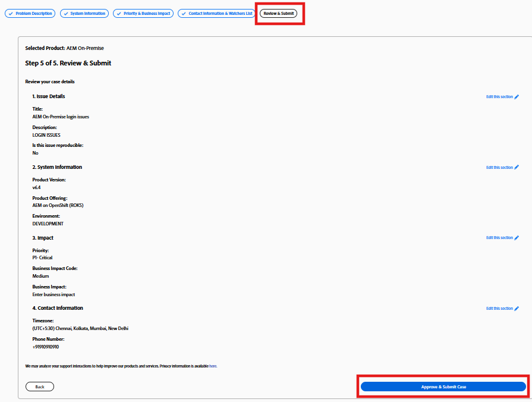

# Esperienza nell’Assistenza clienti di Adobe

## Ticket di supporto Experience League

I ticket di supporto sono ora inviati tramite [Experience League](https://experienceleague.adobe.com/home?lang=it#support). Per istruzioni su come inviare un ticket di supporto, consulta la sezione per [inviare un ticket di supporto](#create-a-support-ticket-with-experience-league).

Stiamo lavorando per migliorarti il modo in cui interagisci con l’Assistenza clienti di Adobe. Il nostro obiettivo è semplificare l’esperienza di supporto passando a un singolo punto di ingresso, utilizzando Experience League. Una volta attivo, l’organizzazione sarà in grado di accedere facilmente all’Assistenza clienti di Adobe, avere maggiore visibilità sulla cronologia dei servizi tramite un sistema comune tra i prodotti e richiedere assistenza tramite telefono, web e chat tramite un singolo portale.

Se sei un utente di Adobe Commerce, consulta [Invia un caso di supporto](https://experienceleague.adobe.com/it/docs/commerce-knowledge-base/kb/help-center-guide/magento-help-center-user-guide#support-case) nella Guida utente del supporto Experience League per Adobe Commerce.

## Ruoli autorizzati di supporto necessari per l’invio dei casi {#submit-ticket}

Per inviare un ticket di supporto in [Experience League](https://experienceleague.adobe.com/home?lang=it#support), è necessario che il ruolo di amministratore del supporto sia assegnato da un amministratore di sistema. Solo un amministratore di sistema della tua organizzazione può assegnare questo ruolo. Prodotto, Profilo prodotto e altri ruoli amministrativi non possono assegnare il ruolo di amministratore del supporto e non sono in grado di visualizzare l&#39;opzione **[!UICONTROL Crea caso]** utilizzata per inviare un ticket di supporto. Per ulteriori informazioni sui diversi tipi di ruoli di amministratore e sui relativi diritti, fare riferimento a [Ruoli di amministratore](adobe-admin-console/admin-roles.md).

Se utilizzi Commerce, la procedura per condividere l’accesso e lavorare con i casi di supporto è diversa. Per ulteriori informazioni, consulta [Accesso condiviso: concedere privilegi ad altri utenti per accedere al tuo account](https://experienceleague.adobe.com/it/docs/commerce-knowledge-base/kb/help-center-guide/magento-help-center-user-guide#shared-access) nella Guida utente del supporto Experience League per Adobe Commerce.

### Aggiunta di ruoli di supporto a un’organizzazione

Il ruolo amministratore del supporto è un ruolo non amministrativo che ha accesso alle informazioni relative al supporto. Gli amministratori del supporto possono visualizzare, creare e gestire i rapporti sui problemi.

Per aggiungere o invitare un amministratore:

1. In Admin Console scegliere **[!UICONTROL Utenti]** > **[!UICONTROL Amministratori]**.
1. Fai clic su **[!UICONTROL Aggiungi amministratore]**.
1. Immetti un nome o un indirizzo e-mail.

   Puoi cercare utenti esistenti o aggiungere un nuovo utente specificando un indirizzo e-mail valido e compilando le informazioni sullo schermo.

   

1. Fai clic su **[!UICONTROL Avanti]**. Viene visualizzato un elenco di ruoli di amministratore.

Per assegnare un ruolo di amministratore del supporto a un utente (consentire a un utente di contattare il supporto):

1. Selezionare l&#39;opzione **[!UICONTROL Amministratore supporto]**.

   

1. Scegliete una delle due opzioni seguenti:

   * Opzione 1: **[!UICONTROL Amministratore del supporto di base]**. Seleziona questa opzione se desideri consentire all’assistenza utente di accedere a tutte le soluzioni (ad eccezione di Marketo Engage).
   * Opzione 2: **[!UICONTROL Amministratore del supporto tecnico]**: selezionare questa opzione per il supporto tecnico Marketo Engage. Seleziona le istanze di Marketo Engage a cui concedere l’accesso al supporto utente.

   

1. Dopo aver effettuato le selezioni, fare clic su **[!UICONTROL Salva]**.

L&#39;utente riceve un invito e-mail relativo ai nuovi privilegi di amministratore da `message@adobe.com`.

Gli utenti devono fare clic su **Inizia** nell&#39;e-mail per partecipare all&#39;organizzazione. Se i nuovi amministratori non utilizzano il collegamento **Inizia** nell&#39;invito e-mail, non potranno accedere ad Admin Console.

Come parte del processo di accesso, agli utenti può essere richiesto di impostare un profilo Adobe se non ne hanno già uno. Se gli utenti hanno più profili associati al loro indirizzo e-mail, devono scegliere **Unisciti al team** (se richiesto) e quindi selezionare il profilo associato alla nuova organizzazione.

Per ulteriori dettagli seguire le istruzioni [modifica ruolo amministratore organizzazione](adobe-admin-console/admin-roles.md#add-enterprise-role) nella documentazione dei ruoli amministrativi. Solo un amministratore di sistema dell’organizzazione può assegnare questo ruolo. Per ulteriori informazioni sulla gerarchia amministrativa, consulta la documentazione di [ruoli amministrativi](adobe-admin-console/admin-roles.md).

### Creare un ticket di supporto con Experience League

>[!NOTE]
>
> Prima di inviare un ticket di supporto, verificare le prestazioni, la disponibilità e i problemi noti del sistema Adobe nel sito [Adobe status](https://status.adobe.com/it).

Experience League è un portale di supporto self-service progettato per fornire assistenza personalizzata e un’esperienza di facile utilizzo ai clienti autorizzati.

1. Per creare un ticket in [Experience League](https://experienceleague.adobe.com/home?lang=it#support), seleziona la scheda **[!UICONTROL Supporto]** nell&#39;area di navigazione superiore.

   

1. Dal menu **[!UICONTROL Home]**, puoi **[!UICONTROL Aprire un ticket di supporto]**, **[!UICONTROL Visualizzare e gestire i tuoi casi]**, **[!UICONTROL Richiedere una richiamata]** o accedere a risorse di apprendimento aggiuntive.

   L&#39;opzione **[!UICONTROL Richiedi callback]** consente di pianificare riunioni Web con condivisione dello schermo, consentendo una risoluzione dei problemi più rapida ed efficiente. È disponibile per Adobe Experience Manager, Campaign e Workfront. Gli incontri possono essere programmati in base alle esigenze del cliente, con la possibilità di ricevere inviti immediati. Per i casi Adobe Experience Manager P1, sono garantiti callback immediati per consentire un coinvolgimento rapido durante i problemi critici, contribuendo a ridurre al minimo i tempi di inattività e l&#39;impatto aziendale.

   

1. Per inviare un caso, selezionare **[!UICONTROL Apri un ticket di supporto]**. Puoi anche selezionare **[!UICONTROL Apri ticket]** nel menu della barra laterale.

   

### Compila il ticket di supporto

Dopo aver selezionato **[!UICONTROL Apri un ticket di supporto]** o **[!UICONTROL Apri ticket]**, viene visualizzato il modulo per la creazione del caso.

Il modulo utilizza un flusso di lavoro guidato in più passaggi che consente di fornire le informazioni necessarie al supporto Adobe per risolvere in modo efficiente il problema. È possibile spostarsi all&#39;interno del modulo utilizzando le sezioni riportate di seguito.

* Selezione prodotti
* Descrizione del problema
* Priorità e impatto aziendale
* Informazioni di contatto e elenco dei sorveglianti
* Rivedi e invia

Puoi anche **passare da una sezione all&#39;altra** per aggiornare le informazioni prima di inviare il caso.

Per creare un ticket di supporto, segui la procedura riportata di seguito:

1. Fare clic sul nome del prodotto per selezionare il prodotto interessato, quindi fare clic su **[!UICONTROL Avanti]**.

   

1. Nella sezione **[!UICONTROL Descrizione del problema]** immettere una descrizione del problema. Il titolo della controversia viene generato automaticamente in base alla descrizione del problema. Se necessario, puoi modificare il titolo. Conferma se il problema può essere riprodotto. Selezionare **Sì** se il problema è riproducibile. Viene visualizzata una casella di testo in cui è possibile descrivere i passaggi necessari per riprodurre il problema. Selezionare **No** se il problema non può essere riprodotto in modo coerente.

   

   Includi dettagli quali:

   * Cosa stai cercando di fare
   * Cosa non funziona come previsto
   * Passaggi già eseguiti
   * Se il problema è riproducibile

   Quando immetti la descrizione del problema, Experience League mostra i consigli basati sull’intelligenza artificiale in un pannello accanto al modulo. Queste raccomandazioni:

   * Suggerisci documentazione pertinente o soluzioni note
   * Ti aiuta a confermare se il problema è già stato risolto
   * Ridurre la necessità di presentare un caso per problemi comuni

   Il pannello dei consigli si adatta al livello di dettaglio della descrizione del problema e viene visualizzato senza interrompere la creazione del caso. Puoi rivedere i consigli in qualsiasi momento e continuare a inviare il caso. Quando la descrizione del problema **supera i 50 caratteri**, il sistema genera consigli basati sull&#39;intelligenza artificiale personalizzati per il problema.

   >[!NOTE]
   >
   >I consigli basati sull’intelligenza artificiale non vengono visualizzati per il prodotto Adobe Admin Console.

   

   Se la descrizione contiene **meno di 50 caratteri**, vengono visualizzati articoli consigliati. Un contatore di caratteri incorporato tiene traccia del requisito minimo in tempo reale.

   

1. Fai clic su **[!UICONTROL Avanti]**.

   

1. Nella sezione **[!UICONTROL Informazioni di sistema]**, fornire **[!UICONTROL Versione prodotto]**, **[!UICONTROL Ambiente]**, **[!UICONTROL Offerta prodotto]** e indicare se sono state apportate modifiche recenti all&#39;ambiente o all&#39;istanza. Seleziona **Sì** per fornire ulteriori dettagli sulle modifiche. Selezionare **No** se non sono state apportate modifiche e fare clic su **[!UICONTROL Avanti]**.

   >[!NOTE]
   >
   > In base al prodotto selezionato, possono essere visualizzati campi aggiuntivi. Questi campi includono dettagli sull’ambiente in cui si verifica il problema.

   

1. Nella sezione **[!UICONTROL Priorità e impatto aziendale]**, seleziona quanto segue:
   * Priorità Caso (P4 - Minore, P3 - Importante, P2 - Urgente, P1 - Critico)
   * Fornisci i dettagli sull&#39;impatto aziendale quando la priorità selezionata è P1 - Critico, quindi fai clic su **[!UICONTROL Successivo]**.

   

   Per informazioni dettagliate su come la priorità dei casi e l&#39;impatto aziendale influiscono sui tempi di risposta del supporto, vedere [Tempi di risposta mirati iniziali per il supporto](https://experienceleague.adobe.com/it/docs/support-resources/data-sheets/overview#targeted-initial-response-times-for-support) nella documentazione relativa alle risorse dei piani di successo.

1. Nella sezione **[!UICONTROL Informazioni di contatto e elenco dei controlli]**, seleziona il fuso orario, immetti il numero di telefono, aggiungi i controlli, allega eventuali file, se necessario, e quindi fai clic su **[!UICONTROL Avanti]**.

   

1. Nella sezione **[!UICONTROL Rivedi e invia]**, controlla i dettagli del caso e fai clic su **[!UICONTROL Approva e invia caso]**.

   

   Il passaggio **[!UICONTROL Rivedi e invia]** riepiloga tutte le informazioni immesse e consente di:

   * Esaminare tutti i dettagli del caso in un&#39;unica posizione
   * Torna a qualsiasi passaggio precedente per apportare modifiche
   * Torna al riepilogo delle revisioni senza perdere l’avanzamento

Dopo l’invio:

* Il caso è registrato in Experience League
* Puoi tenere traccia degli aggiornamenti e comunicare con il supporto tramite il portale
* Il supporto Adobe risponde in base alla priorità e all’impatto forniti

>[!TIP]
>
> Se non trovi l&#39;opzione **[!UICONTROL Apri ticket]** o la scheda **[!UICONTROL Supporto]**, contatta l&#39;amministratore di sistema per assegnare il ruolo di amministratore del supporto.

>[!NOTE]
>
> Se il problema causa interruzioni o interruzioni gravi del sistema di produzione, viene fornito un numero di telefono per l&#39;assistenza immediata.