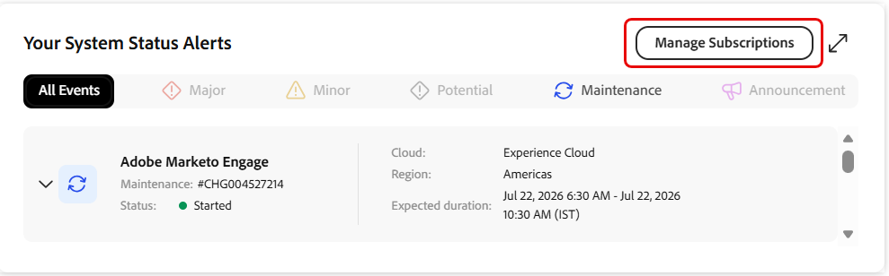

# portale di assistenza Experience League: nuova interfaccia utente

## Panoramica

Il portale riprogettato di supporto Experience League offre un’esperienza unificata e intuitiva per la gestione delle attività di supporto di Adobe. Consente un accesso più rapido alle funzioni essenziali, tra cui il tracciamento dei casi di supporto, il monitoraggio dello stato del prodotto, l’accesso alle informazioni sul caso e la connessione con il team di successo.

>[!NOTE]
>
>Per creare e gestire casi di supporto nel portale riprogettato, vedere [Creare e gestire casi di supporto](exl-new-ui-support-cases.md).

## Pagina Home

La pagina **[!UICONTROL Home]** funge da hub centrale per le attività di supporto. Offre una panoramica dell&#39;ambiente di supporto e accesso rapido alle funzioni chiave.

Il pannello di navigazione a sinistra consente di accedere alle sezioni seguenti:

- **[!UICONTROL Home]** si apre come pagina di destinazione predefinita e visualizza una vista centralizzata dell&#39;attività di supporto.
- **[!UICONTROL Apri caso]** apre il flusso di lavoro per la creazione dei casi nel portale riprogettato.
- **[!UICONTROL I miei casi]** apre l&#39;elenco dei casi nel portale riprogettato.
- **[!UICONTROL Il mio successo]** è disponibile solo per i clienti Ultimate Success plan.

## Cambio di organizzazioni

Se associato a più organizzazioni, utilizzare il **Cambio organizzazione** che si trova nell&#39;angolo superiore sinistro del portale.

Il passaggio da un’organizzazione all’altra consente di aggiornare i dati relativi ai casi, lo stato del prodotto e le informazioni di supporto all’interno del portale, in modo da riflettere l’organizzazione selezionata.

## Passaggio tra i portali

Utilizza l’interruttore nel portale per passare dal portale di supporto Experience League riprogettato al portale corrente.

Entrambi i portali rimangono sincronizzati, garantendo che i dati dei casi e le informazioni di supporto rimangano coerenti tra le diverse esperienze.

La pagina Home include un banner di benvenuto personalizzato con una barra di ricerca globale che consente di effettuare ricerche nel portale di supporto Experience League.

Nella parte superiore della pagina **[!UICONTROL Home]** sono disponibili le seguenti azioni rapide:

1. **[!UICONTROL Aprire un caso di supporto]** - Apre il flusso di lavoro per la creazione del caso nel portale riprogettato. Seleziona **[!UICONTROL Inizia]**.

1. **[!UICONTROL Visualizza e gestisci i tuoi casi]** - Apre la pagina **[!UICONTROL Casi personali]** nel portale riprogettato. Seleziona **[!UICONTROL Vai ora]**.

1. **[!UICONTROL Richiedi richiamata]** - Pianifica una chiamata sul caso con un esperto Adobe. Per i casi P1 (Critici), richiedi un callback immediato. Per i casi P2 e P3, pianifica una riunione web con un tecnico del supporto in una data e un’ora convenienti. Seleziona **[!UICONTROL Richiedi ora]** per iniziare.

## Analisi dei servizi

Nella sezione **[!UICONTROL Service Analytics]** viene visualizzato un riepilogo dell&#39;attività del caso di supporto. Utilizza il selettore di visualizzazione per passare da **[!UICONTROL Casi personali]** a **[!UICONTROL Casi personali]**:

- **[!UICONTROL Casi personali]** - Visualizza le statistiche dei casi specifiche dell&#39;utente.
- **[!UICONTROL Casi organizzazione personali]** - Visualizza le statistiche relative ai casi per l&#39;organizzazione selezionata.

La visualizzazione selezionata si applica a tutte le metriche e a tutti i grafici di questa sezione, inclusi [[!UICONTROL Casi conteggiati per priorità]](#cases-count-by-priority) e [[!UICONTROL Casi personali inviati]](#my-submitted-cases).

La sezione **[!UICONTROL Service Analytics]** fornisce le metriche seguenti:

- **[!UICONTROL Casi di risposta in sospeso]** - Visualizza il numero di casi in attesa di risposta.
- **[!UICONTROL Casi inviati]** - Visualizza il numero totale di casi inviati.

## Conteggio casi per priorità

In questa sezione viene visualizzata una suddivisione visiva dei casi di supporto per livello di priorità.

La selezione **[!UICONTROL Casi personali]** e **[!UICONTROL Casi organizzazione personali]** nella sezione **[!UICONTROL Service Analytics]** si applica a questo grafico e consente la visualizzazione a livello individuale o organizzativo.

Passa il puntatore del mouse su un segmento prioritario per visualizzare una descrizione comando che mostra:

- Numero totale di casi per quel livello di priorità
- Numero di casi aperti
- Numero di casi chiusi

## I miei casi inviati

In questa sezione vengono visualizzati gli ultimi tre casi di assistenza inviati, tra cui:

- ID caso
- Titolo caso
- Priorità
- Data di invio
- Stato

Quando **[!UICONTROL Casi personali]** è selezionato in **[!UICONTROL Analisi servizio]**, in questa sezione vengono visualizzati gli ultimi tre casi inviati. Quando **[!UICONTROL Casi organizzazione personali]** è selezionato nella sezione **[!UICONTROL Analisi servizio]**, vengono visualizzati gli ultimi tre casi inviati nell&#39;organizzazione.

Seleziona un **[!UICONTROL ID caso]** per visualizzare i dettagli del caso nel portale di supporto Experience League riprogettato.

Seleziona **[!UICONTROL Visualizza tutti i casi]** per aprire la pagina **[!UICONTROL Casi personali]** nel portale di supporto Experience League riprogettato.

Il portale preseleziona la scheda che corrisponde alla selezione originale:

- Se selezioni **[!UICONTROL I miei casi]** in **[!UICONTROL Analisi del servizio]**, la scheda **[!UICONTROL I miei casi]** è preselezionata.
- Se selezioni **[!UICONTROL Casi organizzazione personali]** in **[!UICONTROL Analisi servizio]**, la scheda **[!UICONTROL Casi organizzazione personali]** è preselezionata.

## Avvisi sullo stato del prodotto

In questa sezione viene visualizzato lo stato operativo corrente dei prodotti Adobe assegnati all’organizzazione.

Lo stato **[!UICONTROL Disponibile]** indica che il prodotto è completamente operativo senza interruzioni attive. Se sono presenti uno o più problemi, il numero totale di problemi attivi viene visualizzato sulla scheda del prodotto.

I prodotti vengono visualizzati nell&#39;ordine seguente:

1. Prodotti con problemi attivi
1. Prodotti rimanenti, in ordine alfabetico

Questa definizione delle priorità consente di identificare e assegnare rapidamente le priorità ai prodotti che richiedono attenzione. Puoi selezionare una o più schede prodotto per filtrare gli avvisi in **[!UICONTROL Avvisi di stato del sistema]** nella **[!UICONTROL Home]** pagina.

## Avvisi di stato del sistema

In questa sezione vengono visualizzati avvisi in tempo reale per i prodotti Adobe. Puoi filtrare gli avvisi per tipo di evento utilizzando le seguenti schede:

- Grave
- Minore
- Potenziale
- Manutenzione
- Annunci

Inoltre, ogni avviso include:

- Numero problema
- Cloud
- Area geografica
- Stato
- Ora di inizio e di fine per il riferimento

Seleziona un avviso per espandere e visualizzare ulteriori dettagli.

### Gestisci abbonamenti

Utilizza **[!UICONTROL Gestisci abbonamenti]** per configurare le notifiche e-mail per gli eventi relativi allo stato dei servizi e dei prodotti di Adobe. In caso di aggiornamento di un prodotto a cui ti sei iscritto, riceverai un avviso.

1. Nella sezione **[!UICONTROL Avvisi sullo stato del sistema]**, seleziona **[!UICONTROL Gestisci sottoscrizioni]**.

   

2. Nella pagina **[!UICONTROL Gestisci sottoscrizioni]** selezionare **[!UICONTROL Crea sottoscrizione]**.

   

3. In **[!UICONTROL Seleziona cloud]**, seleziona il cloud Adobe che contiene il prodotto da monitorare.
4. In **[!UICONTROL Seleziona prodotto e offerte]**, seleziona il prodotto per il quale desideri ricevere le notifiche.
5. In **[!UICONTROL Selezionare le aree]**, selezionare una o più aree da monitorare.
6. In **[!UICONTROL Selezionare Tipi di evento]**, selezionare uno o più dei seguenti tipi di evento:

   &#x200B;* Problema del servizio grave
   &#x200B;* Problema del servizio non grave
   &#x200B;* Manutenzione del servizio
   &#x200B;* Annunci

   

7. Rivedi le impostazioni di notifica predefinite, tra cui la lingua e il fuso orario.
8. Seleziona **[!UICONTROL Continua]**.
9. Rivedi i dettagli dell’abbonamento, inclusi i tipi di cloud, prodotto, servizi, aree geografiche e evento selezionati.
10. Selezionare **[!UICONTROL Conferma]** per creare la sottoscrizione.

    

11. Viene visualizzato un messaggio di conferma e l’abbonamento viene creato.

Dopo la creazione dell’abbonamento, Adobe invia notifiche e-mail quando vengono creati, aggiornati o risolti eventi che corrispondono ai criteri selezionati per il prodotto, l’area geografica e il tipo di evento.

>[!NOTE]
>
>L’e-mail è il canale di comunicazione predefinito per le notifiche di stato. Le preferenze di abbonamento si applicano solo al prodotto, alle aree geografiche e ai tipi di evento selezionati.

Alla successiva apertura di **[!UICONTROL Gestisci abbonamenti]**, nella pagina vengono visualizzati i dettagli dell&#39;abbonamento corrente, inclusi il cloud, il prodotto, i servizi, le aree geografiche e i tipi di evento selezionati.

Da questa pagina è possibile eseguire le azioni riportate di seguito.

&#x200B;* Selezionare **[!UICONTROL Modifica sottoscrizione]** per modificare una sottoscrizione esistente.
&#x200B;* Seleziona **[!UICONTROL Annulla tutti gli abbonamenti]** per rimuovere tutti gli abbonamenti.
&#x200B;* Per rimuovere un singolo abbonamento, seleziona l’icona Elimina accanto a un abbonamento.

## Informazioni sul piano

In questa sezione vengono visualizzati i dettagli chiave del piano di supporto (Ultimate Success plan e Expert Success plan) e i vantaggi disponibili. Seleziona **[!UICONTROL Ulteriori informazioni]** per esplorare l&#39;intera gamma di offerte di piani.

## Il mio successo

La pagina **[!UICONTROL Il mio successo]** fornisce una visualizzazione personalizzata del coinvolgimento con Adobe. Offre accesso diretto al team di successo, ai vantaggi del programma e alle risorse di apprendimento.

>[!NOTE]
>  
>Questa pagina è disponibile solo per i clienti del piano **[!UICONTROL Ultimate Success]**.

La pagina include:

- Un messaggio di benvenuto che illustra come Ultimate Success fornisce leadership strategica e supporto tecnico proattivo per la salute al fine di fornire esperienze digitali ad alte prestazioni
- Opzione **[!UICONTROL Guarda il video]** per ulteriori informazioni sul piano
- Componenti chiave del piano, tra cui:
  - **[!UICONTROL Team di successo]**
  - **[!UICONTROL Acceleratori per il successo]**
  - **[!UICONTROL Mutual Action Plan]**

Consente inoltre di accedere alle risorse di apprendimento come Experience League, la community Experience League e gli abbonamenti di apprendimento Premium.

### Team di successo Adobe

In questa sezione viene visualizzato il team di successo Adobe dedicato. Seleziona **[!UICONTROL Contatto]** accanto a un membro del team per inviare un&#39;e-mail.

