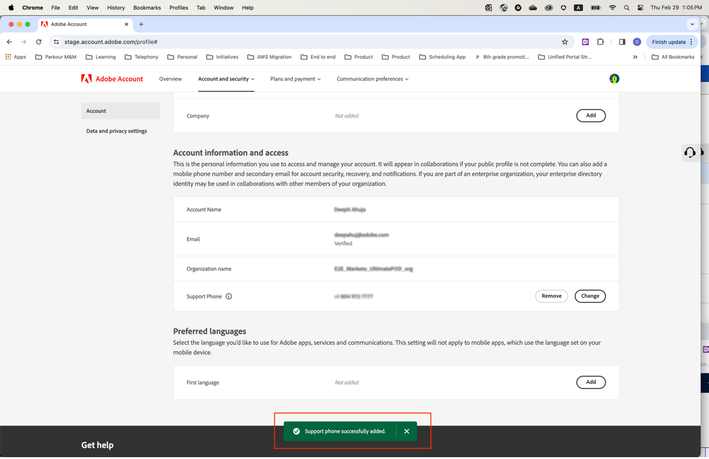

# Specifica un numero di telefono del supporto preferito

Quando ti viene assegnato un ruolo **Amministratore**, ad esempio **Amministratore del supporto tecnico**, ricevi un&#39;e-mail di conferma che disponi delle autorizzazioni di amministratore per gestire l&#39;istanza.

L&#39;e-mail contiene ora il testo in rosso riportato di seguito che spiega come accedere al **[!UICONTROL profilo account]** e condividere con noi il numero di telefono del supporto preferito.

Per specificare il numero di telefono preferito:

1. Fai clic sul collegamento **[!UICONTROL Profilo account]** per aprire una nuova finestra per accedere con `account.adobe.com`.

   

1. Segui la procedura di accesso e accedi alla schermata seguente al `account.adobe.com`.
1. Seleziona **[!UICONTROL Account e sicurezza]** > **[!UICONTROL Account]** per visualizzare il campo del numero di telefono del supporto.
1. Aggiungi qui un numero di telefono da usare per riconoscerti in base alle tue esigenze di supporto.

