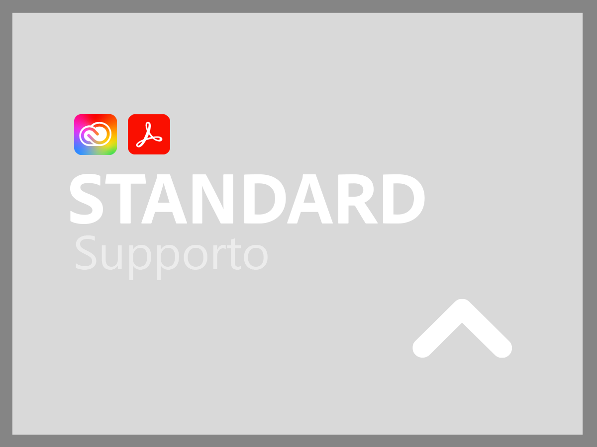
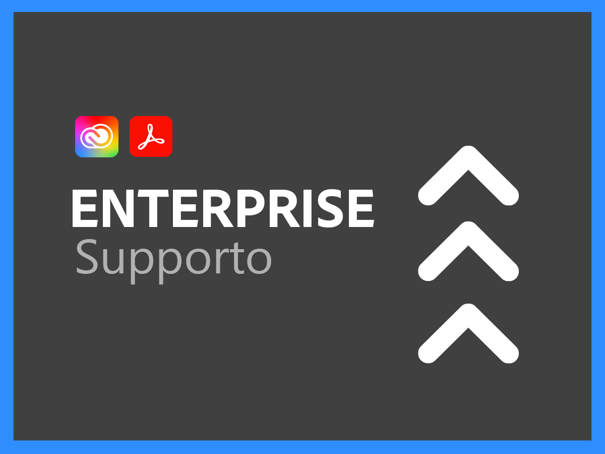

# Panoramica dei servizi di supporto per Creative Cloud Enterprise e Document Cloud

L’organizzazione Adobe Creative Cloud e Document Cloud Customer Support si impegna per il successo ottenuto. Tutte le applicazioni includono un livello di supporto che fornisce un facile accesso alle nostre risorse tecniche altamente qualificate per l&#39;assistenza tecnica.

Per esigenze più complete, offriamo piani di supporto di Adobe che includono l&#39;accesso a professionisti e sessioni di supporto denominati per il supporto proattivo e le revisioni dei servizi. Indipendentemente dalla complessità delle esigenze di supporto, Adobe offre le competenze tecniche e operative necessarie per ottenere prestazioni di picco e un valore ottimale dalle applicazioni di Adobe.

<table style="table-layout:fixed">
<tr>
  <td>
    
    

    <a href="assets/DMeStandardSupportDatasheet_2022.pdf"><strong>Supporto standard</strong></a> 
    

    
Accesso 24 ore su 24, 7 giorni su 7 per gli utenti autorizzati (amministratori) ai nostri team di supporto tecnico tramite chat o telefono, nonché la possibilità di registrare le richieste di assistenza tramite il nostro portale web di supporto. 

     
  </td>
  <td>
    
    

    <a href="assets/DMeBusinessSupportDatasheet_2022.pdf"><strong>Supporto Business</strong></a>
    

    
Routing prioritario per i casi di assistenza per garantire una connessione più rapida a un supporto più senior e la possibilità di sfruttare un lead di supporto per ricevere comunicazioni e aggiornamenti regolari per le richieste di supporto più critiche.

     
  </td>
</tr>
<tr>
  <td>
    
    

    <a href="assets/DMeEnterpriseSupportDatasheet_2022.pdf"><strong>Supporto Enterprise</strong></a>
    

    
Un contatto tecnico designato nel team di supporto Adobe con un'esperienza approfondita nella tua soluzione collaborerà con te e con i tuoi team tecnici per garantire una risoluzione tempestiva di tutte le richieste di supporto.

     
  </td>
  <td>
    
    

    <a href="assets/DMeEliteSupportDatasheet_2022.pdf"><strong>Supporto Elite</strong></a>
    

    
Contatto tecnico designato nel team di supporto Adobe e in un responsabile dell'account tecnico che collabora con l'utente per fornire un supporto proattivo all'avanguardia per massimizzare l'investimento e per aiutarti ad evitare problemi prima che si verifichino.

     
  </td>
</tr>
</table>
