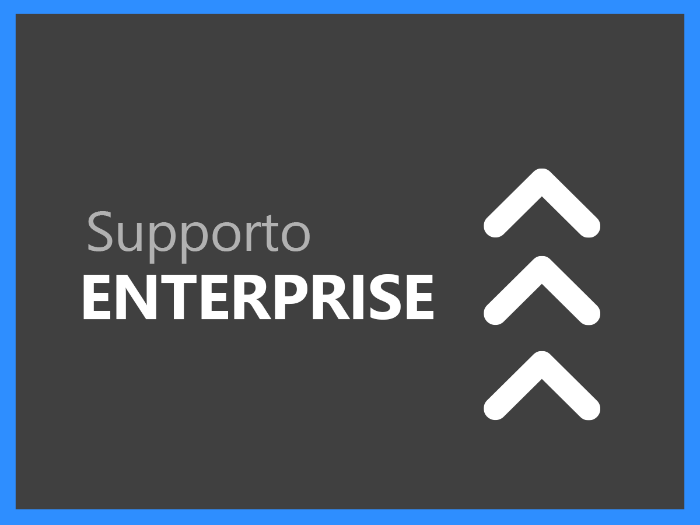
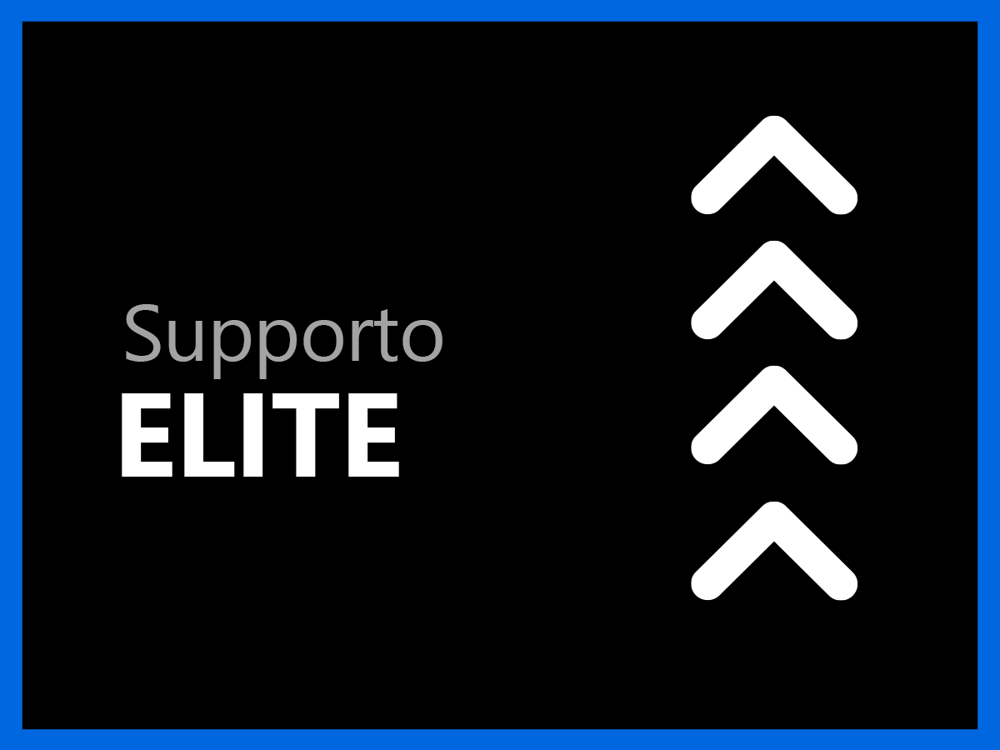

# Panoramica dei servizi di supporto

L’Assistenza clienti per Adobe Experience Cloud ha un unico obiettivo: il successo dei nostri clienti. Tutti gli abbonamenti includono la possibilità di ricevere assistenza tecnica entrando facilmente in contatto con personale tecnico altamente qualificato.

Per esigenze più complete, offriamo i servizi di supporto di Adobe, con accesso a professionisti dedicati, obiettivi di risposta rapidi secondo il livello di servizio, e sessioni di mentoring proattivo e valutazione dei servizi. A prescindere dalla complessità delle tue esigenze di supporto, Adobe ti offre le competenze tecniche e operative necessarie per massimizzare le prestazioni e il valore della tua soluzione Adobe.

<table style="table-layout:fixed">
<tr>
  <td>
    
    

    <a href="online.md"><strong>Supporto Online</strong></a> (vedi <a href="assets/OnlineSupportDatasheet.pdf" target="_blank">PDF</a>)
    

    
Accesso limitato al supporto telefonico

     
  </td>
  <td>
    
    

    <a href="business.md"><strong>Supporto Business</strong></a> (vedi <a href="assets/BusinessSupportDatasheet.pdf" target="_blank">PDF</a>)
    

    
Accesso completo ai team di supporto tecnico di Adobe e a un Account Support Lead per la gestione del proprio account

     
  </td>
</tr>
<tr>
  <td>
    
    

    <a href="enterprise.md"><strong>Supporto Enterprise</strong></a> (vedi <a href="assets/EnterpriseSupportDatasheet.pdf" target="_blank">PDF</a>)
    

    
Obiettivi di livello di servizio più elevati, con un Named Support Engineer dedicato che offre competenze tecniche e sostegno

     
  </td>
  <td>
    
    

    <a href="elite.md"><strong>Supporto Elite</strong></a> (vedi <a href="assets/EliteSupportDatasheet.pdf" target="_blank">PDF</a>)
    

    
Obiettivi di livello di servizio d’eccellenza, supporto proattivo e partnership con un Technical Account Manager e un Named Support Engineer

     
  </td>
</tr>
</table>
